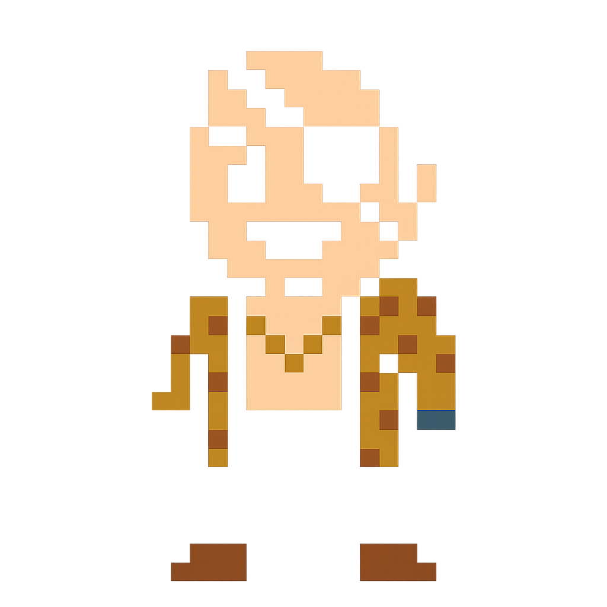
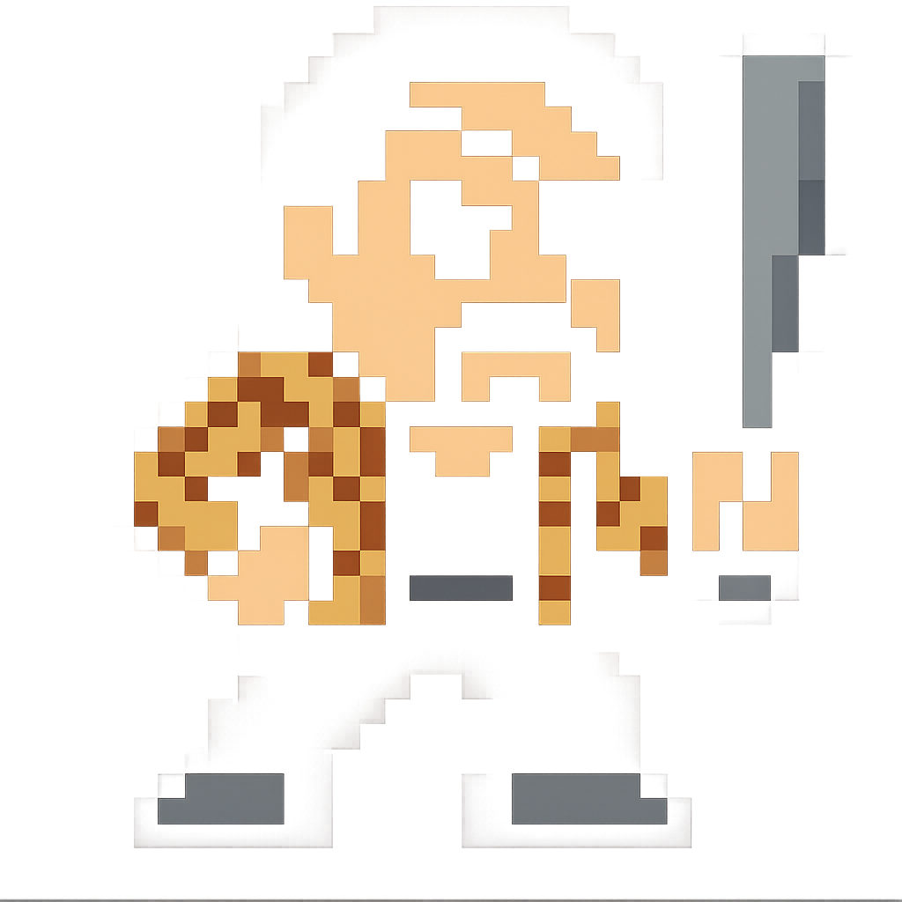

  <code>🐉 Code Like a Dragon</code>

I'm a Computer Applications graduate and a mostly self-taught developer from India. My main focus is Kotlin and Android development, I currently work as a freelance developer, helping small firms and SMEs with system design and automation. Over the past few years, I’ve gained solid experience in developing robust POS systems tailored for wholesale and retail businesses. While Android remains my core strength, I’m also exploring Kotlin Multiplatform (KMP) to broaden my skills.

## Skills & Tech Stack 🤹🏻‍♂️

  
  &nbsp;&nbsp;&nbsp;
  
  &nbsp;&nbsp;&nbsp;
  
  &nbsp;&nbsp;&nbsp;
  
  &nbsp;&nbsp;&nbsp;
  
  &nbsp;&nbsp;&nbsp;
  
  &nbsp;&nbsp;&nbsp;
  
  &nbsp;&nbsp;&nbsp;
  
  &nbsp;&nbsp;&nbsp;
  
  &nbsp;&nbsp;&nbsp;
  
  &nbsp;&nbsp;&nbsp;
  
  &nbsp;&nbsp;&nbsp;
  
  &nbsp;&nbsp;&nbsp;
  
  &nbsp;&nbsp;&nbsp;
  
  &nbsp;&nbsp;&nbsp;
  

---

## Connect with me 

---

## Featured Projects 

<table>
<tr>

<!-- Repo Stats Card -->
<td width="420">
  
</td>

<!-- Playtime -->
<td width="250">

🕒 120 hrs on record  
⏱️ Last commit: 5 days ago

</td>

</tr>
</table>

---

## Outside of Code 

When I’m not shipping features or fixing bugs, you’ll probably find me:

- Sinking balls on the snooker table
- Gaming to unwind
- Learning and building—because there’s always more to create

---

  
**Always open to new challenges and collaborations!**

